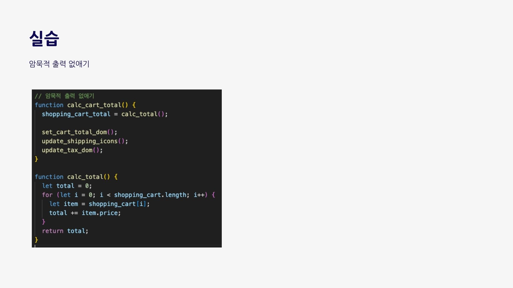

# 발표자료

# 네트워킹 질문

#### 4장은 액션에서 계산을 분리하는 내용을 다루고 있습니다. 그렇다면, 이를 어느 단계까지 쪼개는 것이 좋을까요? 혹은 자신만의 기준이 있나요?

#### 액션에서 계산을 빼내다 보면 코드가 길어지게 됩니다. 만약 이렇게 분리해낸 계산이 아주 많아졌을 때, 이를 어떻게 관리할 수 있을까요?

#### 5장까지의 내용을 통해 우리는 액션, 계산, 데이터를 분류할 수 있게 되었고 리팩토링하는 법도 배웠습니다. 이를 우리의 실제 업무에 어떻게 적용할 수 있을까요?

# 후기

|                                                                              참여자                                                                               | 후기 |
| :---------------------------------------------------------------------------------------------------------------------------------------------------------------: | :--: |
|                                                       |      |
|                                                  |      |
|                                                    |      |
|  |      |
