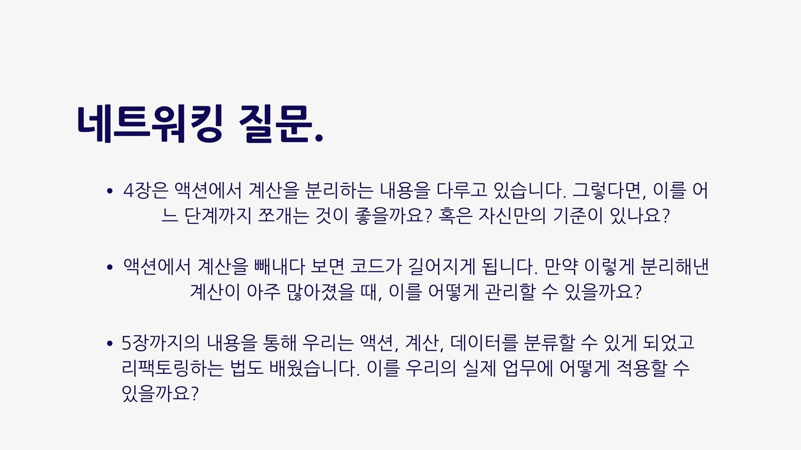

# 발표자료

# 후기

|                            참여자                            | 후기                                                         |
| :----------------------------------------------------------: | :----------------------------------------------------------- |
|  |                                                              |
|  | 앞선 5장까지의 내용을 통해 "액션,"계산,"데이터"라는 구분을 배우고 이를 더 명확하게 이해하게 되었습니다. 특히 이번주에는 액션에서 계산을 분리하는 실용적인 3가지 방법을 알게 되었고, 실제로 내가 작성하는 코드에도 적용하기 위한 방법을 고민해 볼 수 있었습니다. 동료들과 의견을 나누고 실제로 코드를 보면서 개선했던 경험을 공유해주어서 앞으로 제가 개발하면서 지향해야 될 방향에 대해 알게 된 것 같아서 기뻤습니다. 이제 FP를 본격적으로 시작하는 느낌이 들고, 이 마음으로 끝까지 스터디를 완주하고자 다짐했습니다. |
|  |                                                              |
|  |                                                              |
